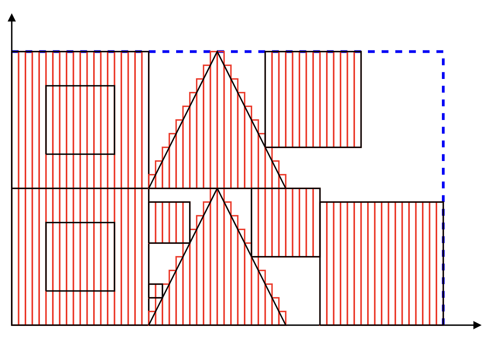
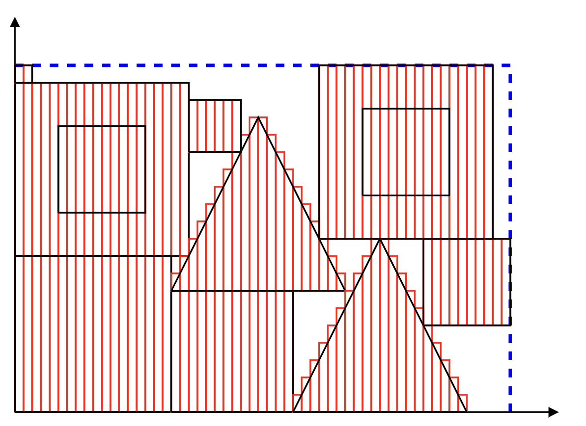

# Nesting of 2-D Sheet Parts

## Introduction

This is a simple implementation of the [Nesting of 2-D Sheet Parts](https://www.researchgate.net/publication/3448963_Fast_Nesting_of_2-D_Sheet_Parts_With_Arbitrary_Shapes_Using_a_Greedy_Method_and_Semi-Discrete_Representations) algorithm.

## References

- https://www.researchgate.net/publication/3448963_Fast_Nesting_of_2-D_Sheet_Parts_With_Arbitrary_Shapes_Using_a_Greedy_Method_and_Semi-Discrete_Representations
- https://developer.mozilla.org/en-US/docs/Web/SVG
- https://images.autodesk.com/adsk/files/autocad_2012_pdf_dxf-reference_enu.pdf
- https://www.euro-online.org/websites/esicup/data-sets/#1535972088237-bbcb74e3-b507

## Results

Input:

Output:

## TODO:
- [x] Support holes
- [x] Add support for arbitrary shapes
- [ ] Read patterns from DXF (support CLO3D, etc.)
- [ ] Export result to DXF
- [x] Support rotation for shapes